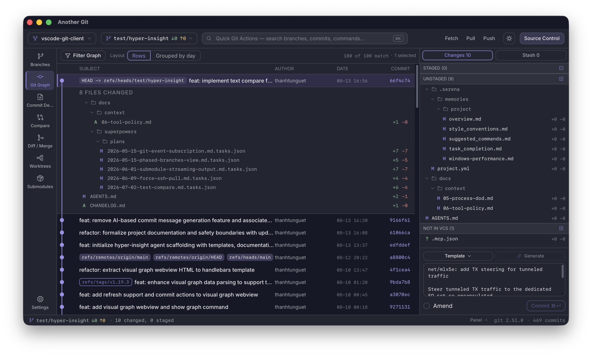

# Another Git

A fast, native desktop Git client built with **Tauri** (Rust backend) and **React + TypeScript** (frontend). Inspired by the IntelliJ Git client experience, with a VS Code‑style layout: a resizable navigation sidebar, a source-control dock, and a bottom panel for output and an integrated terminal.



## Features

### Repository & top toolbar
- Open, clone, and switch between multiple repositories, with the repository and branch persisted across app restarts.
- One-click **Fetch / Pull / Push** with async spinner feedback that never blocks the UI.
- Global **Quick Git Actions** search (⌘K) with fuzzy action search, branch/tag suggestions, and commit-ID lookup.
- Light/dark theme toggle.

### Git Graph
- Virtualized, infinite-scroll commit graph with row/grouped-by-day layouts.
- Searchable multi-select filters for branches, tags, and authors (OR within a category, AND across categories), plus day-bounded From/To date pickers.
- Commit context menu: checkout, create branch/tag at commit, cherry-pick, revert, soft/mixed/hard reset, copy hash, create patch (copied to clipboard).
- Clicking a commit opens its changed-file list; changed files are shown as collapsible folder trees, with inline diff alongside a compact graph list.

### Branches
- IntelliJ-style branch tree grouped by Local / Remote / remote-name / path folders, with tags sorted by most-recent-first (including folder grouping).
- Checkout, create, rename, merge into current branch, rebase, set/unset upstream, and delete local/remote branches.
- Unified Branch/Tag reset dialog with Soft/Mixed/Hard explanations and a live command preview.
- Recent-commits pane per selected branch or inspected tag revision.

### Source Control
- Staged / Unstaged / Untracked ("Not in VCS") grouping with stage, unstage, stage-all, unstage-all, and discard actions.
- Commit message templates and AI-assisted commit message generation from the staged diff.
- Amend support and full stash management (create, apply, pop, drop) via context menus.
- Merge conflict resolution tab with conflict counters and Keep Ours / Keep Theirs / Mark Resolved controls.

### Diff / Merge & Compare
- Side-by-side (2-column) and unified (1-column) diff viewer with a block-pairing algorithm, dual line-number gutters, and per-pane text selection.
- Live diffs for working tree, index, and commit files; untracked files render as add-from-empty diffs.
- Branch/commit **Compare** view with commit and file summaries, and patch/summary export.

### Worktrees & Submodules
- Worktree management: add, lock/unlock, prune, and open a worktree in the file manager or system terminal.
- Submodule management: init, update, sync, checkout recorded commit, pull tracked branch, pointer diff, stage pointer, and deinit — grouped by health (Needs attention / Clean / Uninitialized).

### Bottom panel
- VS Code-style reorderable, persistent **Output** and **Terminal** tabs.
- Integrated terminal backed by a Tauri PTY, starting in the active repository, with split/kill panes and a confirmation modal before killing a session.

### Safety & UX
- All destructive operations (hard reset, revert, discard, drop stash, etc.) go through a custom confirmation dialog — no native browser `confirm`/`alert`/`prompt`.
- Every panel (sidebar, source control dock, console drawer, branch tree, commit details, diff, compare) is independently resizable with persisted layout.

## Tech Stack

- **Frontend**: React 19, TypeScript, Vite, Sass
- **Desktop shell**: [Tauri 2](https://tauri.app/)
- **Backend**: Rust (`src-tauri/`) shelling out to the system `git` binary
- **Terminal**: `@xterm/xterm` over a Tauri PTY bridge

This repository also contains a companion VS Code extension in [`vscode-git-client/`](vscode-git-client) that brings a similar workflow into the editor — see its own [README](vscode-git-client/README.md) for details.

## Getting Started

```bash
# install dependencies
pnpm install

# run the Tauri desktop app in dev mode
pnpm tauri:dev

# build the desktop app
pnpm tauri:build
```

Other useful scripts:

```bash
pnpm dev          # run the frontend alone in the browser (Vite dev server)
pnpm typecheck    # TypeScript check
pnpm lint         # ESLint
pnpm format       # Prettier
```

## Project Structure

```
src/                  React frontend (views, components, hooks, services)
src-tauri/             Rust backend (Tauri commands, Git operations)
vscode-git-client/     Companion VS Code extension
docs/                  Requirement notes and dated changelogs
```
